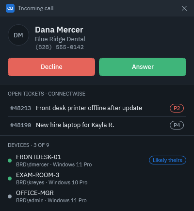

<div align="center">


# CallBridge

**A Windows softphone for MSP technicians, with ConnectWise screen pops.**

When a customer calls, CallBridge shows their company and open tickets, saves your call
notes to a ticket, and drafts the time entry when you hang up.

[](#requirements)
[](https://github.com/ithealthtech/CallBridge-Releases/releases/latest)
[](docs/quick-start.md#4-connect-connectwise-admin)
[](https://ithealthtech.github.io/CallBridge-Releases/)

[**Documentation site**](https://ithealthtech.github.io/CallBridge-Releases/) ·
[Download](https://github.com/ithealthtech/CallBridge-Releases/releases/latest) ·
[Quick start](docs/quick-start.md) ·
[Troubleshooting](https://ithealthtech.github.io/CallBridge-Releases/support.html)

</div>

---

## What this repository is

This is CallBridge's **public release channel**. It holds the released installers and the
documentation site. Installed copies of CallBridge check this repository's latest release
for updates. The application source code is kept in a private repository.

## What you get

- **Screen pop.** Incoming calls show the contact, company, up to five open tickets, and (optionally) the company's devices with the caller's own marked.
- **Notes on the ticket.** Type during the call, and keep adding notes after it ends in wrap-up.
- **Time you confirm.** A time entry draft appears after each call, ready to check and save.
- **Voicemail and parking.** Message count and park-slot status on the Home screen.
- **Transfers.** Blind or consult-first.
- **Your branding.** Your logo and accent color, with an admin PIN on phone and ConnectWise settings.
- **Automatic updates.** A badge appears when a new version is ready; nothing installs during a call.



<sub>Screenshots use sample data only.</sub>

## Install

1. Download `CallBridge-v….msi` from the [latest release](https://github.com/ithealthtech/CallBridge-Releases/releases/latest).
2. Run it and approve the Windows admin prompt.
3. Open CallBridge from the Start menu and follow the [quick start guide](docs/quick-start.md).

```powershell
# Optional: compare with the SHA256 in the release notes
Get-FileHash "$env:USERPROFILE\Downloads\CallBridge-v*.msi" -Algorithm SHA256
```

> [!WARNING]
> The installer is not code-signed yet, so Windows SmartScreen may warn you. Only run
> installers downloaded from this repository's releases.

> [!CAUTION]
> CallBridge is not approved for emergency calling. Keep another phone available for 911.

### Requirements

| | |
| --- | --- |
| **Windows** | Windows 10 (1809 or later) or Windows 11, x64 |
| **Phone system** | Any SIP PBX. HivePBX has a built-in preset. |
| **Ticketing** | ConnectWise PSA (API member) or ConnectWise Platform (OAuth API access) |
| **Audio** | Any headset Windows recognizes |
| **Install rights** | Local admin approval for the MSI and for updates |

## Quick start

| Step | Who | Where in CallBridge |
| --- | --- | --- |
| 1. Install the MSI | Admin | — |
| 2. Enter extension and SIP login, then **Register** | Admin | Settings → Phone account, SIP |
| 3. Choose PSA or Platform, enter keys, **Test** | Admin | Settings → ConnectWise |
| 4. **Sync ConnectWise contacts** | Admin | Settings → ConnectWise |
| 5. Set an **Admin PIN** | Admin | Settings → Branding & security |
| 6. Choose headset, enter **member ID** | Everyone | Settings → Audio, Sign-in |
| 7. Make a test call | Everyone | — |

Full step-by-step instructions, including where to find each value in HivePBX and
ConnectWise: **[docs/quick-start.md](docs/quick-start.md)** or the
[documentation site](https://ithealthtech.github.io/CallBridge-Releases/guide.html).

## Feature support by connection

| Feature | ConnectWise PSA | ConnectWise Platform |
| --- | :---: | :---: |
| Open tickets in the screen pop | ✅ | ✅ |
| Create a ticket | ✅ | ✅ |
| Call notes on a ticket | ✅ | ✅ |
| Time entries | ✅ | Saved as a ticket note |
| Caller matching | All contacts | Company main number and primary contact, plus imported contacts |
| Open ticket in browser | ✅ | Ticket number shown |
| Save a caller's number to a contact | ✅ | Not available (add it in ConnectWise) |
| Caller's devices (from RMM) | ✅ with Platform API access | ✅ |
| ConnectWise RMM tickets | Appear as normal tickets | Same |

## Documentation

| For technicians | For admins |
| --- | --- |
| [Quick start](docs/quick-start.md) | [Connect the phone](docs/quick-start.md#3-connect-the-phone-account-admin) |
| [Using CallBridge day to day](docs/quick-start.md#using-callbridge-day-to-day) | [Connect ConnectWise](docs/quick-start.md#4-connect-connectwise-admin) |
| [Troubleshooting](https://ithealthtech.github.io/CallBridge-Releases/support.html) | [Updates](docs/quick-start.md#updates) |

The end-user site is published at <https://ithealthtech.github.io/CallBridge-Releases/>.

## Support

Create a support bundle from **Settings → Sign-in → Create support bundle** and send it to
your administrator. Passwords, keys, phone numbers, email addresses, and file paths are
removed from the bundle.

## License

Proprietary. Copyright © 2026 IT Health Tech LLC. All rights reserved.
