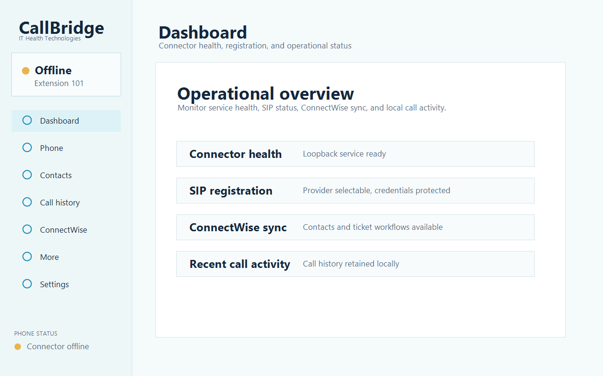
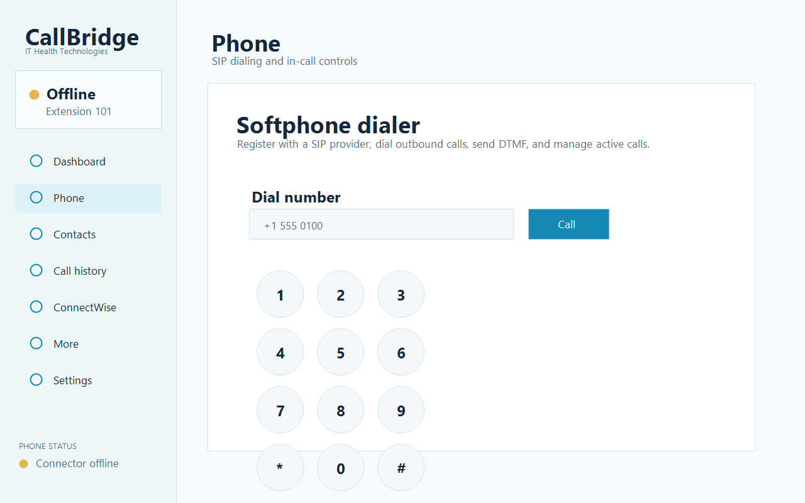

# CallBridge

CallBridge is a white-label Windows VoIP desktop application with standard SIP calling and ConnectWise-assisted MSP workflows.

This repository is the production source tree. Historical prototypes and generated release artifacts are intentionally excluded.

## Screenshots

| Dashboard | Phone | Settings |
| --- | --- | --- |
|  |  |  |

## Repository layout

- `src/CallBridge.Desktop` — .NET 8 WPF desktop application and SIP media client.
- `src/CallBridge.Service` — .NET 8 loopback-only call context and local integration service.
- `tests` — cross-component integration and security regression tests.
- `docs` — security architecture, operating guidance, and release documentation.

## Development requirements

- Windows 10 or Windows 11
- .NET 8 SDK

## Run

From PowerShell:

```powershell
.\Start-CallBridge.ps1
```

The launcher generates an ephemeral local API credential, removes only a verified orphaned CallBridge service from the selected port, starts the service on loopback, starts the desktop application, and stops the service it owns when the desktop exits.

Runtime data is stored under `%LOCALAPPDATA%\IT Health Technologies\CallBridge`. The default call-history retention period is 90 days and can be changed for a session with `-CallRetentionDays`.

## Verify

```powershell
dotnet restore .\CallBridge.sln
dotnet build .\CallBridge.sln -c Release --no-restore
dotnet test .\tests\CallBridge.Service.Tests\CallBridge.Service.Tests.csproj -c Release --no-build
dotnet run --project .\src\CallBridge.Desktop\tests\CredentialSmokeTest.csproj -c Release
dotnet run --project .\src\CallBridge.Desktop\tests\ConnectWiseSmoke\ConnectWiseSmoke.csproj -c Release
dotnet run --project .\src\CallBridge.Desktop\tests\SipMediaSmoke\SipMediaSmoke.csproj -c Release
dotnet run --project .\src\CallBridge.Desktop\tests\SipTransportSmoke\SipTransportSmoke.csproj -c Release
```

## SIP transport

SIP signalling defaults to **TLS on port 5061**, with the PBX certificate validated against
the Windows trust chain. Choose the transport under **Settings → SIP transport**; TCP and
UDP remain available for a PBX that cannot offer TLS, and both send credentials and
signalling in the clear.

A `sips:` address, or a server ending in `:5061`, always uses TLS regardless of the stored
transport setting, so a secure address cannot be silently downgraded.

If a PBX presents a self-signed certificate, install it in the machine trust store. There is
no option to skip certificate validation.

> TLS protects signalling only. Call audio is still plain RTP — SRTP is not implemented.

## Security posture

- The service binds only to loopback.
- All service routes other than `/health` require a random per-session bearer credential.
- Browser origins and non-loopback host headers are rejected.
- Request sizes and rates are bounded, and logs omit sensitive payloads.
- SIP signalling defaults to TLS and validates the PBX certificate against the Windows trust chain, with no certificate-bypass option.
- Desktop secrets are excluded from serialized settings and protected with Windows DPAPI.
- Call history has configurable retention, authenticated export, and confirmed deletion.
- Runtime databases and logs are stored under the current user's local application-data directory.

See [SECURITY.md](SECURITY.md) and [docs/SECURITY-ARCHITECTURE.md](docs/SECURITY-ARCHITECTURE.md).

## Release status

CallBridge is under active development and is not yet approved for production emergency calling. Licensing and production distribution terms must be selected before public publication.
