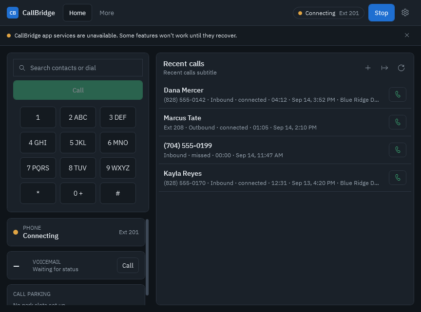
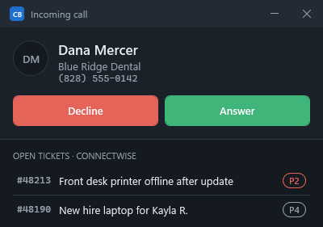
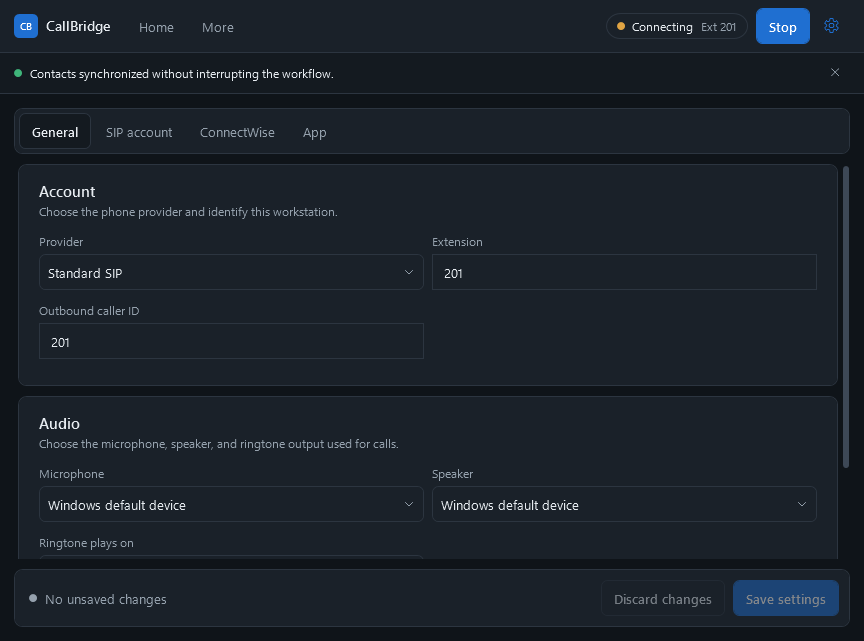
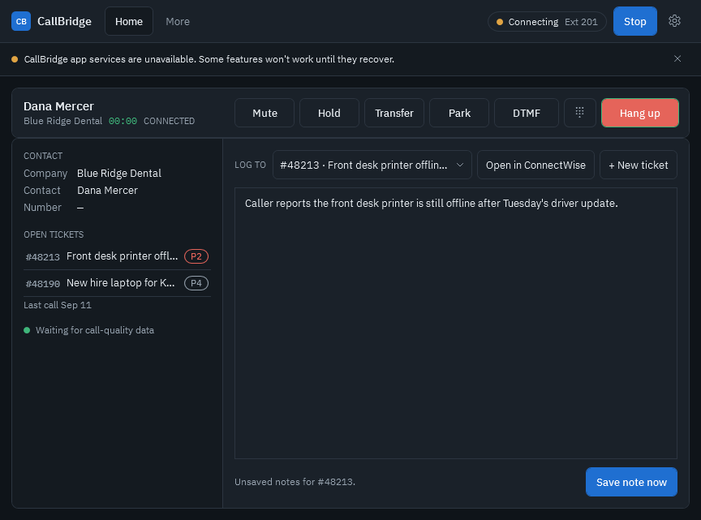

# CallBridge

CallBridge is a white-label Windows VoIP desktop application with standard SIP calling and ConnectWise-assisted MSP workflows.

This repository is the production source tree. Historical prototypes and generated release artifacts are intentionally excluded.

## Screenshots

| Home | Incoming call | Settings |
| --- | --- | --- |
|  |  |  |

The main window has two tabs and a settings gear. **Home** uses two columns: on the left, a search-and-dial box, a full-width Call button, the keypad, and status cards for the phone, voicemail, and call parking; on the right, recent calls at full height. Typing searches the contact directory. Each row has a call button, and selecting or hovering a row shows its actions (Company, New ticket, Notes, and Edit or Delete for local contacts). Narrow windows fall back to a single column with the keypad on demand. **More** holds voicemail and call parking. Voicemail shows new and saved counts from the phone system's SIP message-waiting notifications (subscribed after registration, and unsolicited notifications are accepted too), badges the More tab, and dials the voicemail access code. Call parking lists the configured park slots with busy or open status from SIP dialog subscriptions and picks up a parked call by dialing the optional pickup prefix plus the slot. During a call, **Park** opens inline slot choices (and **Any open slot** when a park code is set) and blind-transfers the caller there. Voicemail access code, park slots, park code, and pickup prefix are admin settings under **Phone account**; confirm the values with your phone system provider. Choosing the **Axion / HivePBX** provider fills any empty fields with HivePBX defaults: voicemail `*97`, park code `4388`, and park slot `4389` (pick up by dialing the slot). Settings has **Audio** and **Sign-in** for every technician (devices, phone status, ConnectWise member ID, startup, support bundle). **Phone account**, **SIP**, **ConnectWise** (including directory sync and CSV import), and **Branding & security** are admin sections that require the admin PIN once one is set under Branding & security. Branding & security also sets the white-label product name, accent color (validated for readable white button text), and a PNG or JPEG logo up to 1 MB; the accent recolors buttons, tabs, highlights, and the tray icon, and the logo replaces the product initials in the header and screen pop.

During a call the window switches to the call workspace: the call bar shows the caller, company, timer, and Mute, Hold, Transfer, DTMF, and Hang up. The left panel shows the matched ConnectWise contact and open tickets; the right panel has inline blind or consult transfer, a ticket picker with Open in ConnectWise and New ticket, and call notes that save to the selected ticket as an internal note. The picker starts on **No ticket** and keeps the technician's choice when the caller lookup finishes, so notes and time only reach a ticket the technician picked. Unsaved notes are saved to that ticket when the call ends, or copied to the clipboard if no ticket is selected. New ticket works for any caller: when the caller is not matched, the ticket dialog searches ConnectWise companies by name. After a call with a ticket selected, a Log call time card offers a time entry; drafts from back-to-back calls wait in order.



## Repository layout

- `src/CallBridge.Desktop` — .NET 10 WPF desktop application and SIP media client.
- `src/CallBridge.Service` — .NET 10 loopback-only call context and local integration service.
- `tests` — cross-component integration and security regression tests.
- `docs` — security architecture, operating guidance, and release documentation.

## Development requirements

- Windows 10 or Windows 11
- .NET 10 SDK

## Run

From PowerShell:

```powershell
.\Start-CallBridge.ps1
```

Create the self-contained Windows x64 payload used by the installer:

```powershell
.\Publish-CallBridge.ps1 -Configuration Release -Runtime win-x64
```

The production payload includes the .NET 10 runtime and does not require a separate machine-wide .NET installation.

The launcher generates an ephemeral local API credential, removes only a verified orphaned CallBridge service from the selected port, and starts both packaged processes. Direct executable launches use the same desktop-owned sidecar model: CallBridge drains service output, checks health, restarts an unexpectedly failed child, and stops only the service process it owns when the desktop exits.

CallBridge runs from the Windows notification area. Opening CallBridge shows its window. When it launches at Windows sign-in with a phone configured, it starts hidden with a tray icon whose status dot shows registered, reconnecting, offline, or on a call. Clicking the icon opens a small status panel with Open CallBridge, Settings, and Quit. Closing the main window hides it to the tray; calls keep ringing and still open the screen pop. If no phone is configured yet, the window opens even at sign-in so setup can be completed.

CallBridge is single-instance within each signed-in Windows session. Launching it again restores and activates the existing window instead of creating a second SIP registration, media session, or local service.

Once a configured phone has been enabled with **Register**, CallBridge preserves that intent and registers automatically on later launches. Choosing **Unregister** disables automatic registration until the user enables the phone again. Network and Windows resume recovery defer re-registration while a call is active and resume it when the call ends.

The **Launch when I sign in to Windows** option stores a per-user startup command that is restricted to `CallBridge.Desktop.exe`. The command is fully quoted, includes the `--startup` marker, and is repaired automatically when an enabled installation moves during an upgrade.

Runtime data is stored under `%LOCALAPPDATA%\IT Health Technologies\CallBridge`. The default call-history retention period is 90 days and can be changed for a session with `-CallRetentionDays`.

## Audio devices

CallBridge lists the Windows microphones and speakers available to the current user. The selections in **Settings > Audio** are applied to new inbound and outbound SIP media sessions. A separate ringtone output plays for inbound calls and stops when the call leaves the ringing state. The page provides microphone, speaker, and ringtone tests plus a refresh action for newly connected headsets.

If a saved device is disconnected or removed, CallBridge falls back to the Windows default device and shows a user-facing warning. Device identifiers remain internal; the interface displays only friendly device names. The current media library uses the Windows multimedia default endpoint rather than claiming Windows communications-role selection.

## SIP signaling

The SIP account page supports UDP, TCP, and TLS signaling. The selected transport is applied to registration, outbound calls, and transfers. TLS uses the Windows certificate trust chain and rejects certificate errors, including hostname mismatches; there is no insecure certificate-bypass setting. New installs default to TLS. A `sips:` server address or port 5061 always uses TLS regardless of the stored transport, so a secure address cannot be silently downgraded; saved UDP or TCP choices are otherwise honoured because some PBXs, including HivePBX extensions, accept only UDP. Media encryption with SRTP remains a separate capability and is not implied by selecting TLS signaling.

RTP sessions reject arbitrary source-endpoint replacement. SIPSorcery's constrained first-packet NAT correction remains available when a provider advertises a private media address but sends from a public address; broader endpoint switching requires an explicit, reviewed interoperability decision.

During calls, CallBridge collects aggregate RTCP media diagnostics for the negotiated codec, received packet count, send/receive loss, jitter, and round-trip timing when the provider supplies the required sender-report data. The snapshot contains no network addresses, SIP identifiers, caller numbers, or credentials and is exposed through the call-state accessibility help text for support use.

When the user has chosen Register, CallBridge debounces Windows network-address changes and power-resume notifications, then rebuilds the selected signaling channel and re-registers. Recovery is cancelled by an explicit Stop action, a provider or SIP-settings change, or application shutdown. An active call is never interrupted for recovery; the retry is deferred until the call ends.

Inbound calls play through the selected ringtone output and use a native Windows notification plus taskbar attention. A compact screen-pop window comes to the front over other applications with Answer and Decline, the caller's matched ConnectWise contact and company, and up to five open tickets; selecting a ticket opens it in ConnectWise. Answering opens the main call window. The pop closes as soon as the call stops ringing.

SDP-bearing SIP 183 responses are presented as early media while the call remains in the guarded ringing state. Remote hold and resume re-INVITEs update the same deterministic call state used by the controls, so the UI cannot report a connected call while the far end has placed it on hold.

Transfers support blind REFER and an attended workflow. Consult first holds and pauses the primary media, establishes a separate consultation session, and exposes Complete or Cancel controls. Cancellation, consultation failure, remote consultation hangup, primary-call loss, and application shutdown clean up the second session and resume or terminate the primary call as appropriate.

## Verify

```powershell
dotnet restore .\CallBridge.sln
dotnet build .\CallBridge.sln -c Release --no-restore
dotnet test .\tests\CallBridge.Service.Tests\CallBridge.Service.Tests.csproj -c Release --no-build
dotnet run --project .\src\CallBridge.Desktop\tests\CredentialSmokeTest.csproj -c Release
dotnet run --project .\src\CallBridge.Desktop\tests\ConnectWiseSmoke\ConnectWiseSmoke.csproj -c Release
dotnet run --project .\src\CallBridge.Desktop\tests\SipMediaSmoke\SipMediaSmoke.csproj -c Release
dotnet run --project .\src\CallBridge.Desktop\tests\SipTransportSmoke\SipTransportSmoke.csproj -c Release
dotnet run --project .\src\CallBridge.Desktop\tests\ResponsiveLayoutSmoke\ResponsiveLayoutSmoke.csproj -c Release
.\tests\Invoke-PackagedStartupSmoke.ps1 -Configuration Release
```

## Security posture

- The service binds only to loopback.
- All service routes other than `/health` require a random per-session bearer credential.
- Browser origins and non-loopback host headers are rejected.
- Request sizes and rates are bounded, and logs omit sensitive payloads.
- Desktop secrets are excluded from serialized settings and protected with Windows DPAPI.
- Settings use atomic replacement and encrypted corruption recovery; pending call events use a DPAPI-protected retry queue.
- Call history has configurable retention, authenticated export, and confirmed deletion.
- Runtime databases and logs are stored under the current user's local application-data directory.

See [SECURITY.md](SECURITY.md) and [docs/SECURITY-ARCHITECTURE.md](docs/SECURITY-ARCHITECTURE.md).

## Release status

CallBridge is under active development and is not yet approved for production emergency calling. Licensing and production distribution terms must be selected before public publication.
