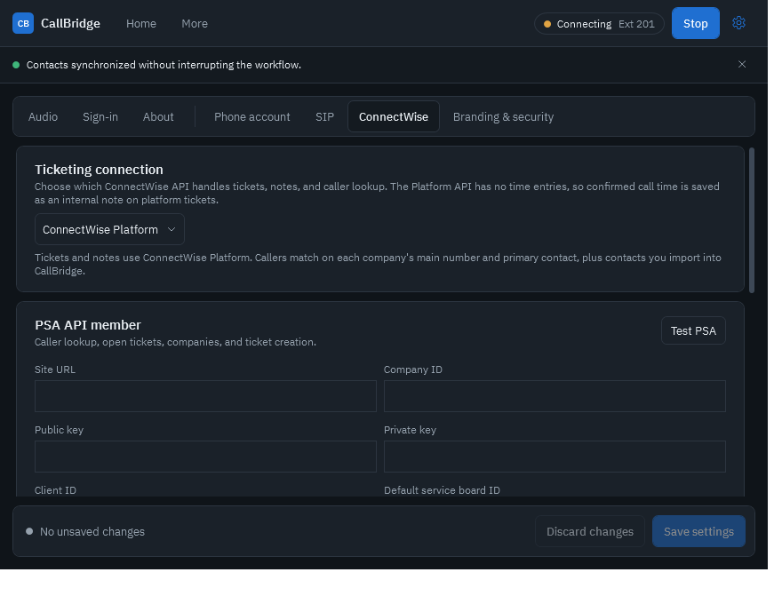
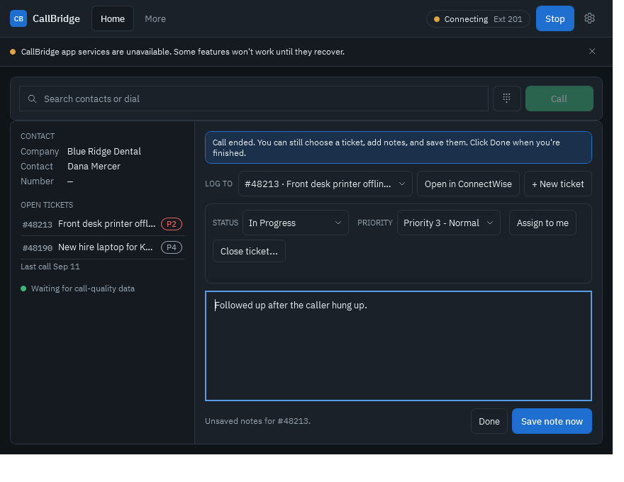

# CallBridge quick start guide

Set up CallBridge in about 10 minutes. Steps marked **(Admin)** are done once per computer by
whoever manages your phone system and ConnectWise. Steps marked **(Everyone)** are for each
technician.

> A formatted version of this guide is on the
> [documentation site](https://ithealthtech.github.io/CallBridge-Releases/guide.html).

**On this page:** [Before you start](#before-you-start) ·
[1. Install](#1-install-admin) ·
[2. Open Settings](#2-open-settings) ·
[3. Phone](#3-connect-the-phone-account-admin) ·
[4. ConnectWise](#4-connect-connectwise-admin) ·
[5. Customers](#5-load-your-customers-admin) ·
[6. Headset](#6-choose-your-headset-everyone) ·
[7. Member ID](#7-add-your-member-id-everyone) ·
[8. Admin PIN](#8-protect-admin-settings-admin) ·
[9. Test call](#9-make-a-test-call-everyone) ·
[Day to day](#using-callbridge-day-to-day) ·
[Wrap-up](#wrap-up-notes-after-the-call-ends) ·
[Updates](#updates) ·
[Checklist](#setup-checklist)

---

## Before you start

| What | Where to get it | Needed for |
| --- | --- | --- |
| **Extension number** | Your phone system (for example `101`) | Phone |
| **SIP server, username, password** | Your phone provider or PBX admin | Phone |
| **ConnectWise PSA API member keys** | ConnectWise PSA → System → Members → API Members | PSA tickets |
| **ConnectWise Platform client ID and secret** | ConnectWise → Integrations → API Access | Platform tickets |
| **Your ConnectWise member ID** | The username you sign in to ConnectWise with | Time entries |
| **A headset** | Any USB, Bluetooth, or jack headset Windows recognizes | Calls |

> [!CAUTION]
> CallBridge is not approved for 911 or other emergency calling. Keep another phone available.

## 1. Install (Admin)

1. Open the [latest release](https://github.com/ithealthtech/CallBridge-Releases/releases/latest) and download `CallBridge-v….msi`.
2. Double-click the MSI and approve the Windows admin prompt. CallBridge installs for everyone on the computer.
3. Open CallBridge from the Start menu or desktop shortcut. A blue CallBridge icon also appears in the system tray.

> [!WARNING]
> The installer isn't code-signed yet, so SmartScreen may show "Windows protected your PC".
> Choose **More info → Run anyway** only for installers downloaded from the release page.
> You can compare the file with the SHA256 in the release notes:
>
> ```powershell
> Get-FileHash "$env:USERPROFILE\Downloads\CallBridge-v*.msi" -Algorithm SHA256
> ```

## 2. Open Settings

Click the **gear icon** in the top-right corner.

| Tabs | Who uses them |
| --- | --- |
| **Audio · Sign-in · About** | Every technician |
| **Phone account · SIP · ConnectWise · Branding & security** | Admins. Locked behind an admin PIN once one is set. |

After changing anything, click **Save settings** at the bottom.

## 3. Connect the phone account (Admin)

### Phone account tab

| Field | What to enter |
| --- | --- |
| **Provider** | **Axion / HivePBX** for HivePBX (fills in transport, codecs, voicemail code, and park code). Otherwise **Standard SIP**. |
| **Extension** | Your extension, for example `101`. |
| **Outbound caller ID** | Optional. The number customers see when you call out. |
| **Voicemail access code** | HivePBX: `*97`. |
| **Park code** | Parks a call in the next open slot. HivePBX: `4388`. |
| **Park slots** | Slot numbers to watch, such as `4389` or `701-705`. Slots only, not the park code. |
| **Pickup prefix** | Optional digits dialed before a slot. Leave blank for HivePBX. |

### SIP tab

| Field | What to enter |
| --- | --- |
| **SIP server or domain** | Your PBX address. HivePBX: your company's `….hivepbx.com` address. |
| **SIP username** | Usually your extension, for example `101`. |
| **SIP password** | The extension's SIP secret (not your voicemail PIN). HivePBX hides it in the admin panel; ask your provider if you don't have it. |
| **Transport** | What your provider supports. HivePBX: **UDP** (set for you). |
| **Codec profile** | Leave the default unless your provider says otherwise. |

1. Click **Save settings**.
2. Click **Register** in the top bar. The status pill turns green and shows your extension.

Your SIP password is stored encrypted for your Windows account and is never included in
support bundles.

## 4. Connect ConnectWise (Admin)

Open the **ConnectWise** tab and choose a **Ticketing connection**:

| Choice | Use it when | Time entries |
| --- | --- | --- |
| **ConnectWise PSA** | You use ConnectWise PSA with API member keys. Recommended today. | Real PSA time entries |
| **ConnectWise Platform** | You've moved to ConnectWise Platform with OAuth API access. | Saved as an internal ticket note |
| **Platform, with PSA contact lookup** | You're moving from PSA to Platform. Tickets go to Platform; contacts still come from PSA. | Saved as an internal ticket note |



### ConnectWise PSA

In ConnectWise PSA:

1. **System → Members → API Members → +.** Give it a security role that can read companies,
   contacts, and service tickets, create tickets and notes, create time entries, and add and edit contacts (used to save callers' numbers).
2. Open the member → **API Keys → +**. Copy the public and private key. The private key is
   shown only once.
3. **Service → Setup Tables → Service Boards.** Open the board for phone tickets; the number
   at the end of the page address is its ID.

In CallBridge, fill in the **PSA API member** card:

| Field | Example |
| --- | --- |
| **Site URL** | `na.myconnectwise.net` |
| **Company ID** | The company name you type on the ConnectWise sign-in page |
| **Public key / Private key** | From the API member |
| **Client ID** | Your integration client ID from the ConnectWise Developer Network |
| **Default service board ID** | `27` |

Click **Test PSA**. You should see *ConnectWise PSA authentication succeeded.* Then save.

### ConnectWise Platform

1. In ConnectWise: **Integrations → API Access → Generate Access.** Select **Tickets – Read**,
   **Tickets – Create**, **Tickets – Update**, and **Companies – Read**. Copy the client ID
   and secret.
2. In the **ConnectWise Platform** card, choose your region, then paste the **OAuth client ID**
   and **client secret**. The scopes are filled in for you:

   ```text
   platform.tickets.read platform.tickets.create platform.tickets.update platform.companies.read
   ```

3. Click **Test Platform**, then **Save settings**.
4. Click **Load boards and sources**, choose the **Default service board** and a **Ticket
   source** such as *Phone*, and save again.

> [!NOTE]
> ConnectWise's Platform API has no time entries, no contact search, and no ticket web links.
> CallBridge saves call time as an internal note, matches callers by each company's main
> number and primary contact (plus contacts you import), and shows the ticket number to open
> in ConnectWise.

### Show the caller's devices (optional)

CallBridge can list the caller's company devices in the incoming call window: name, online or
offline, who last signed in, and the operating system. A device whose last user matches the
caller's name is marked **Likely theirs** and shown first. It works with either ticketing
connection, because the devices come from ConnectWise Platform.

1. In ConnectWise: **Integrations → API Access**, edit CallBridge's access and add
   **Devices – Read**. Do this first, or Platform sign-in will fail.
2. In the **ConnectWise Platform** card, enter the client ID and secret if you haven't, tick
   **Show the caller's devices in the call pop-up**, and save. CallBridge adds
   `platform.devices.read` to the scopes for you.
3. Click **Test Platform**, then take a call from a customer.

### ConnectWise RMM

Tickets that RMM creates in PSA or Platform, such as patching or device alerts, appear in the
incoming call window like any other open ticket. To also see the caller's **devices**, turn on
[Show the caller's devices](#show-the-callers-devices-optional).

## 5. Load your customers (Admin)

CallBridge recognizes callers by matching their number against its directory.

- **Sync ConnectWise contacts** (ConnectWise tab) downloads every active contact with a phone
  number. On Platform it downloads companies and their main numbers.
- **Import CSV** adds contacts from a spreadsheet.
- **Add contact** adds one person by hand.
- **Save number to ConnectWise** (during or after a call) adds an unknown caller's number to
  a ConnectWise contact. It needs the PSA connection, and the API member's security role must
  allow adding and editing company contacts.

Numbers match however they're formatted: `(732) 297-7575`, `732-297-7575`, and
`+17322977575` are the same caller.

## 6. Choose your headset (Everyone)

1. Plug in the headset, open **Settings → Audio**, and click **Refresh devices** if needed.
2. Choose the headset for **Microphone** and **Speaker**. Set **Ringtone plays on** to your
   computer speakers so you hear calls with the headset off.
3. Use **Test microphone**, **Test speaker**, and **Test ringtone**, then save.

## 7. Add your member ID (Everyone)

**Settings → Sign-in → Your member ID:** the username you sign in to ConnectWise with. PSA
time entries are logged under it.

- **Launch when I sign in to Windows** starts CallBridge in the tray so you never miss a call.
- **Keep CallBridge on top during active calls** keeps notes and controls visible.

## 8. Protect admin settings (Admin)

**Settings → Branding & security → Admin PIN.** Enter 4 to 12 digits twice and click
**Set PIN**. You can also set your **logo** and **accent color** here.

## 9. Make a test call (Everyone)

1. Check that the status pill is green with your extension.
2. Call your line from a mobile phone.
3. The incoming call window shows the caller and, for customers, their company and open
   tickets. Click **Answer**.
4. Try **Mute** and **Hold**, then hang up. If you picked a ticket, check the minutes on the
   time entry draft and click **Save time**.

## Using CallBridge day to day

| To do this | Do this |
| --- | --- |
| **Call someone** | Type a name or number in *Search contacts or dial* and press Enter or **Call**, or click the phone button on a recent call or contact. |
| **Answer from anywhere** | The incoming call window appears on top of other apps, with a Windows notification. |
| **Take notes on a ticket** | Pick the ticket and type. **Save note now** saves immediately; unsaved notes save when you hang up. Each save adds a separate note. |
| **Save an unknown caller's number** | Click **Save number to ConnectWise** under their details, or **Save number** on the recent call. Search for the company, pick the contact or create one, choose Direct or Mobile, and save. Needs the PSA connection. |
| **Add a note to an older call** | Select the call in *Recent calls* and click **Add note** to write on one of that company's open tickets. |
| **Finish notes after the call** | When the caller hangs up the notes panel stays open. Choose a ticket, keep typing, save, then click **Done**. See [Wrap-up](#wrap-up-notes-after-the-call-ends). |
| **Change a ticket's status or priority** | Pick the ticket in *LOG TO*, then use **Status** and **Priority** in the ticket bar. Changes apply right away. |
| **Take ownership** | Click **Assign to me** in the ticket bar (PSA tickets; uses your member ID). |
| **Close a ticket** | Click **Close ticket…**, choose the closed status, confirm the resolution (your call notes are filled in), and close. |
| **Create a ticket** | Click **+ New ticket** during the call. For unknown callers, search for the company first. |
| **Transfer** | **Transfer** → enter the extension → **Blind transfer**, or **Consult first**. |
| **Park a call** | Click **Park**. On Home, click **Pick up** next to the busy slot, or dial the slot from any phone. |
| **Check voicemail** | The Voicemail card on Home shows new messages. Click **Call** to listen. |
| **Log time** | After a call with a ticket picked, adjust the minutes and click **Save time**. |
| **Hide CallBridge** | Close the window. It keeps running in the tray and still rings. Right-click the tray icon to quit. |

## Wrap-up: notes after the call ends

When the customer hangs up, the notes panel stays open in **wrap-up** so you can finish
writing up the call:

- **Choose a ticket** in *LOG TO*, or click **+ New ticket**, even after the call has ended.
- **Keep typing and click Save note now.** Each save adds a separate internal note, and the
  box clears so your next note is its own entry.
- **Click Done** when you're finished. Wrap-up also closes as soon as the next call starts.

Already clicked **Done**, or taken another call since? On Home, select the call in *Recent
calls* and click **Add note**. CallBridge loads that company's open tickets so you can write
the note on the right one; if there are none open, choose **New ticket instead**. The
**Call notes** button beside it edits CallBridge's own call log, not ConnectWise.

Notes typed during the call are still saved automatically to the chosen ticket when the call
ends. Clicking **Done** with notes typed and no ticket chosen copies them to your clipboard.



## Updates

CallBridge checks for updates when it starts and every 6 hours. When one is ready, an
**Update available** badge appears next to your extension. Click it and approve the Windows
prompt; CallBridge closes, updates, and can be reopened from the Start menu. It never updates
during a call.

To check yourself: **Settings → About → Check now**, or **Check for updates** in the tray
icon's pop-up.

## Setup checklist

| Check | Works when |
| --- | --- |
| Phone | Green status pill with your extension |
| ConnectWise | **Test PSA** or **Test Platform** reports success |
| Customers | Searching a customer's name on Home finds them |
| Headset | The microphone test hears you and the speaker test plays a tone |
| Voicemail | The Voicemail card shows a message count |
| Parking | The Call parking card lists your slots |
| Test call | The pop-up shows the caller's company and open tickets |

Something not right? See
[Troubleshooting](https://ithealthtech.github.io/CallBridge-Releases/support.html).
